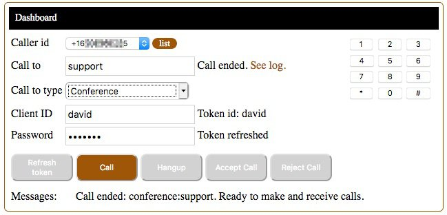

# Voice Call Client Application Version 1.2

From a web browser, people can make and receive voice calls.

This application is ready to run,
and deploy to Heroku. A free [Heroku](https://heroku.com/) account will work fine for testing.
Once you have an account, stay logged in for the deployment and configuration.

[](https://heroku.com/deploy?template=https://github.com/tigerfarm/tigcall)

When you deploy to Heroku, you will be prompted for an app name. The name needs to be unique.
Example, enter your name+app (example: davidapp). 
Click Deploy app. Once the application is deployed, click Manage app. 
Now, set the Heroku project environment variables by clicking Settings. 
Click Reveal Config Vars.

Add the following key value pairs:

- ACCOUNT_SID : your_account_SID (starts with "AC", available from [Twilio Console](https://www.twilio.com/console))
- AUTH_TOKEN : your_account_auth_token (Available from [Twilio Console](https://www.twilio.com/console))
- TOKEN_PASSWORD : your_token_password (Password is required to create tokens. You create the password for your users)
- VOICE_TWIML_APP_SID_CALL_CLIENT :  Voice TwiML App SID to make calls. You can create it here: https://www.twilio.com/console/voice/twiml/apps
- API_KEY_SID : API Keys are revokable credentials for the Twilio API. You can create it here: https://www.twilio.com/console/dev-tools/api-keys
- API_KEY_SECRET : The secret text of the above API Key.

Client Screen print:



## Twilio Console Configurations

1 - Create a Twilio Function that returns TwiML to make a voice call.
The Twilio Function URL will be used in the next step.

In your Function, use the following code, and:
+ Change "dave" (clientid) to be your voice client id.
+ Change "+16505551111" (theCallerId) to be one of your Twilio phone numbers
that will be used as caller id when making an outbound PSTN call.

````
// Create voice call TwiML.
// Example: <Response><Dial callerId="+16505551111" record="do-not-record">+16505552222</Dial></Response>

exports.handler = function(context, event, callback) {
    console.log("---------------------------------------------------------");
    //
    let clientid = "dave";
    let theCallerId = "+16505551111";
    //
    let callFrom = event.From || null;
    let callTo = event.To || null;
    let twiml = new Twilio.twiml.VoiceResponse();
    if (callFrom === null) {
        twiml.say({voice: 'alice', language: 'en-CA', }, 'Error placing the call. The From-caller is required.');
        callback(null, twiml);
        return;
    }
    if (callTo === null) {
        twiml.say({voice: 'alice', language: 'en-CA', }, 'Error placing the call. The To-caller is required.');
        callback(null, twiml);
        return;
    }
    console.log("+ Call From: " + callFrom);
    console.log("+ Call To: " + callTo);
    //
    // Set callerid by mapping Client id or phone number to a phone number.
    //
    if (callTo.startsWith("client:")) {
      	// Leave as is because this is a Client to Client call.
    } else if (callTo.startsWith("conference:")) {
        //                       "12345678901"
        // callFrom = callTo.substr(11);
      	callFrom = clientid;
    } else if (callTo.startsWith("queue:")) {
      	// Leave as is because this is a Client to queue call.
    } else if (callFrom === "client:"+clientid) {
        // Note, you can add more client ids to match callerids by adding more "else if" clauses.
        callFrom = theCallerId;
    } else {
        console.log("- Error: Client id not in the list.");
        twiml.say({voice: 'alice', language: 'en-CA', }, 'Error placing the call. Unknown client id.');
        callback(null, twiml);
        return;
    }
    console.log("+ Caller id: " + callFrom);
    //
    let dialParams = {};
    dialParams.callerId = callFrom
    dialParams.record = "do-not-record"
    if (callTo.startsWith("sip:")) {
        console.log("+ Make a SIP call.");
        twiml.dial(dialParams).sip(callTo);
    } else if (callTo.startsWith("client:")) {
        //                        1234567
        console.log("+ Make a Client call.");
        twiml.dial(dialParams).client(callTo.substr(7));
    } else if (callTo.startsWith("conference:")) {
        //                        12345678901
        console.log("+ Make a Conference call.");
        twiml.dial(dialParams).conference(callTo.substr(11));
    } else if (callTo.startsWith("queue:")) {
      	//                        123456
        console.log("+ Make a queue call.");
        twiml.dial(dialParams).queue(callTo.substr(6));
    } else {
        console.log("+ Make a PSTN call.");
        twiml.dial(dialParams, callTo);
    }
    callback(null, twiml);
};
````

2 - Create a Voice TwiML Application entry using the above Twilio Function URL.
This is used in the token to link to the Function whichs makes the phone calls.
In the Console, go to:

[https://www.twilio.com/console/voice/runtime/twiml-apps](https://www.twilio.com/console/voice/runtime/twiml-apps)
    
1. Click Create new TwiML App
2. Enter the following:
   - Friendly name: Make a call
   - Voice, Request URL: https://voice-2357.twil.io/makecall (Use your Twilio Function URL from above)
3. After clicking Save, go back into the app entry to get the app SID.
   - The SID is used as a web server environment variable.
   - Example: APeb4627655a2a4be5ae1ba962fc9576cf

2 - Create an API Key SID and secret text. API Keys are revokable credentials for the Twilio API.
The values are use as your web server environment.
You can create API Key SID and secret text here: https://www.twilio.com/console/dev-tools/api-keys

3 - Testing Steps

If on the Heroku website, use a browser to access the website Twilio Client URL,
example (replace "davidapp" with your Heroku application name):

    https://davidapp.herokuapp.com/

1. Enter a Client ID, example your first name. Enter the password (the value of your environment variable, TOKEN_PASSWORD).
2. Click Refresh token. The message, Token refreshed, is displayed.
3. In the "Call to" field, enter: support. Select Call to type: Conference.
4. Click Call, and you will be connect to the Twilio conference named, support.
    You will hear the classic Twilio conference music.
5. In another browser, use the Voice Client, with different Client ID, join the conference.
6. Click Hangup to disconnect from the conference, or click End conference to disconnect all participants in the conference.
7. View the call log. In a separate tab, log into the Twilio Console.
    Beside Call to, click, See log.
8. Call your mobile phone number.
   In the "Call to" field, enter your mobile phone number.
   Select Call to type: PSTN.
   Click Call, and your mobile phone will be dialed.
9. Have someone else use this Voice Client, with different Client ID. Call them.
   In the "Call to" field, enter the other person's Client ID.
   Select Call to type: Twilio Client.
   Click Call, and you will be connected to the other client.
   They will need to Accept the call, for you to talk together.

--------------------------------------------------------------------------------

## For Developers

### Files

The Client files:
- [index.html](index.html) and [client.js](client.js) : Twilio Client HTML and JavaScript (JS) files to make and receive phone calls.
- [custom/app.css](custom/app.css) : Styles

The server files:
- [nodeHttpServer.js](nodeHttpServer.js) : a NodeJS HTTP Server that serves the Client files.
This is used to run the Twilio Client locally on a computer.

Heroku Hosting Service
- [app.json](app.json) : Heroku deployment file to describe the application.
- [composer.json](composer.json) : Heroku deployment file which sets the programming language used.

## Local host Implementation

The server side can run locally on a computer using NodeJS, or run on a website that runs PHP programs.

Note, the Twilio Node.JS helper library is not required.

### Local Server Side Setup using a NodeJS Webserver

Download the project zip file.

    https://github.com/tigerfarm/tigcall

1. Click Clone or Download. Click Download ZIP.
2. Unzip the file into a work directory.
3. Change into the unzipped directory: tigcall-master.

Install the NodeJS "request" module:
    
    $ npm install request

Run the NodeJS HTTP server.

    $ node nodeHttpServer.js
    +++ Start: nodeHttpServer.js
    Static file server running at
      => http://localhost:8000/
    CTRL + C to shutdown
    ...
    
Use a browser to access the Twilio Client:

    http://localhost:8000/index.html
    
Next, add Twilio Functions.

### Remote Server Side Setup using a PHP Webserver

Download the project zip file. Unzip the file into your website's CGI bin directory, or in any directory that will automatically run clientTokenGet.php as PHP program when called from HTTP. Test by displaying the Client in your browser, example URL:

    https://example.com/cgi/index.html

## Ready to Test

If running locally, use a browser to access the Twilio Client:

    http://localhost:8000/index.html

Use the above testing steps.

Cheers...
